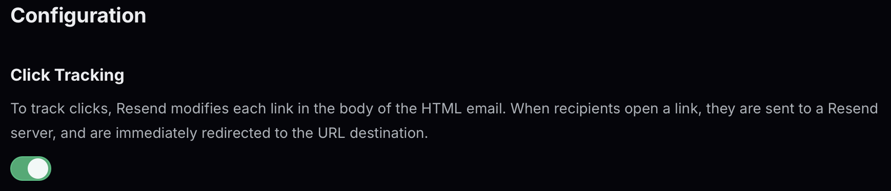
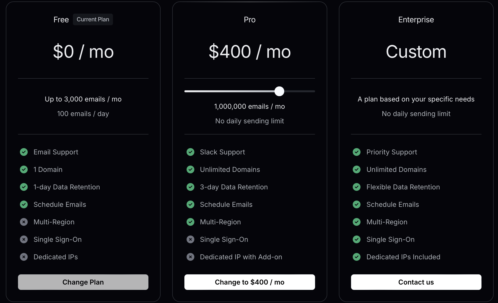
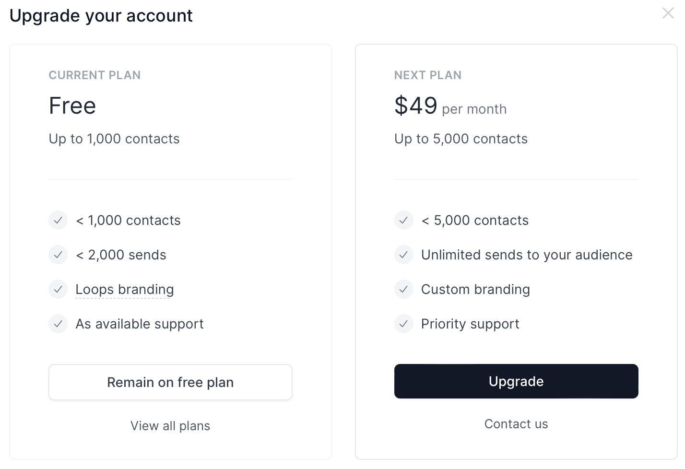

## AWS SES
[Docs](https://docs.aws.amazon.com/ses/latest/APIReference/Welcome.html)
- [Pricing](https://aws.amazon.com/ses/pricing/). Very cheap.
    - $0.10 / 1000 outbound emails
    - $0.12 / GB of data in attachments
    - "If you send email by using an application hosted in Amazon EC2, you pay for your compute usage, as well as data transfer fees for the data you send out of EC2."
    - "You pay outgoing data charges regardless of whether you send email from an application hosted in EC2 or from an application hosted elsewhere."
- [Configuration Sets](https://docs.aws.amazon.com/console/ses/configuration-sets):
- Options for analytics

- [Quotas](https://docs.aws.amazon.com/ses/latest/dg/quotas.html#:~:text=Sending%20quotas,-Quotas%20are%20based&text=If%20your%20account%20is%20in,on%20your%20specific%20use%20case.&text=second%20(sending%20rate)-,If%20your%20account%20is%20in%20the%20sandbox%2C%20you,send%201%20email%20per%20second.):
    - size: 40 MB per message
    - recipients: 50 per message. "If you need to send an email message to a larger audience, you can divide your recipient list into groups of 50 or fewer, and then call the SendEmail operation several times to send the message to each group" ([SendEmail](https://docs.aws.amazon.com/ses/latest/APIReference/API_SendEmail.html))
         - AWS recommends sending messages to a single recipient at a time in most cases. "...it is a best practice to send a message to multiple recipients by iteratively using a single recipient in the Destination argument of the SendEmail operation." ([source](https://aws.amazon.com//blogs/messaging-and-targeting/how-to-send-messages-to-multiple-recipients-with-amazon-simple-email-service-ses/))
- Deliverability issues?
    - May need to think hard about how to prevent emails from going to spam by setting up IPs and authentication properly

Other resources:
https://www.reddit.com/r/sysadmin/comments/y8xcl7/looking_for_the_most_costeffective_userfriendly/

https://www.reddit.com/r/devops/comments/1bijx9u/massemail_providers_worth_it_vs_just_using_ses/

https://www.reddit.com/r/SaaS/comments/135lgwu/email_sending_api/

## Resend
[Docs](https://resend.com/docs/send-with-go)
- VERY easy setup. User friendly. Intuitive and readable docs.
- Has a native "broadcasts feature" for sending a single email to large group of recipients simultaneously
- Click tracking feature

- Pricing

[resend-go-example](https://github.com/resend/resend-go-example) GitHub repo showing how to use Resend with Go

## Loops
- Strengths:
    - Really easy to use visual editor for building email templates. Kind of like Notion. Simple no code approach.
    - Automated drip campaigns for sending pre-written messages to contacts over time.
    - Contact management
    - Deliverability and email placement
    - Can schedule email sends and newsletter campaigns
- Weaknesses:
    - API is too light? Lacking in developer tools and features
    - Users can't add their own domains as verified senders

Worried about limitations in scalability? Can it handle sending emails to 1M+ contacts? How quickly can it do this and how much does it cost?

https://www.youtube.com/watch?v=bJMN5OwyE1o