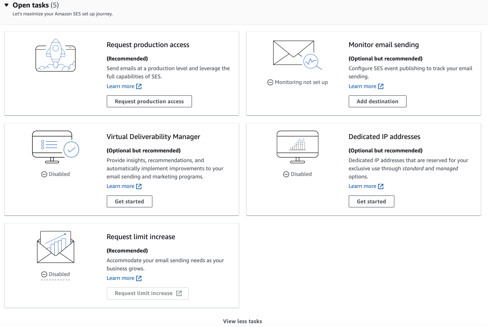

## [AWS SES](https://aws.amazon.com/ses/pricing/)
[Docs](https://docs.aws.amazon.com/ses/latest/APIReference/Welcome.html)
- $0.10 / 1000 outbound emails
    - $0.12 / GB of data in attachments
- "If you send email by using an application hosted in Amazon EC2, you pay for your compute usage, as well as data transfer fees for the data you send out of EC2."
- "You pay outgoing data charges regardless of whether you send email from an application hosted in EC2 or from an application hosted elsewhere."

- [Configuration Sets](https://docs.aws.amazon.com/console/ses/configuration-sets):
    - "Configuration sets are groups of rules that you can apply to the emails you send using Amazon SES. You apply a configuration set to an email by including a reference to the configuration set in the headers of the email. When you apply a configuration set to an email, all of the rules in that configuration set are applied to the email."
- Tasks dashboard

- Max message size of 10MB?
- [SendEmail](https://docs.aws.amazon.com/ses/latest/APIReference/API_SendEmail.html) API call
    - "The message may not include more than 50 recipients, across the To:, CC: and BCC: fields. If you need to send an email message to a larger audience, you can divide your recipient list into groups of 50 or fewer, and then call the SendEmail operation several times to send the message to each group."