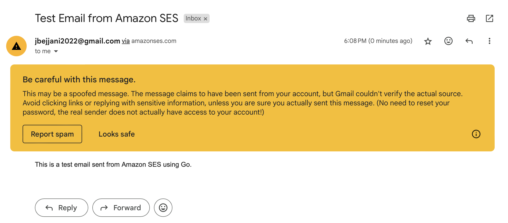
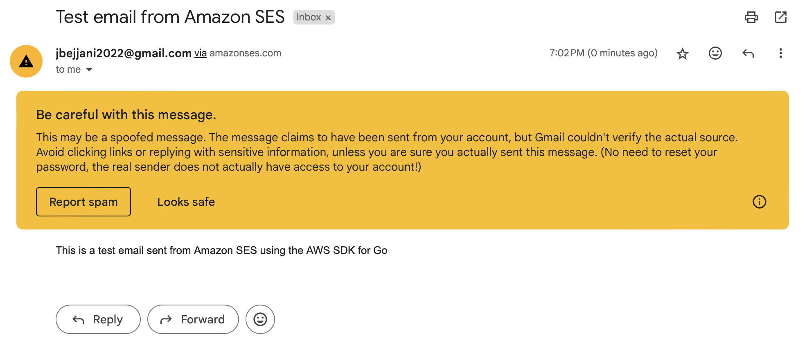

Comparison of AWS Simple Email Service, Resend, and Loops.

Send test emails using each of the services.

## Setup

To use `ses/`, create a `ses/.env` with the following environment variables:
`SMTP_USERNAME`, `SMTP_PASSWORD`, `FROM_EMAIL`, `TO_EMAIL`, `AWS_ACCESS_KEY_ID`, `AWS_SECRET_ACCESS_KEY`, `AWS_REGION`.

## `ses/`
contains email sending scripts using AWS SES. `smtpsend` does so by connecting to an SES SMTP endpoint. `apisend` does so by the AWS SDK for Go (installed as a dependency) to make direct calls to the SES API. See the successful sends below:

